# SRv6-cheatsheet

## End
### End without flavor
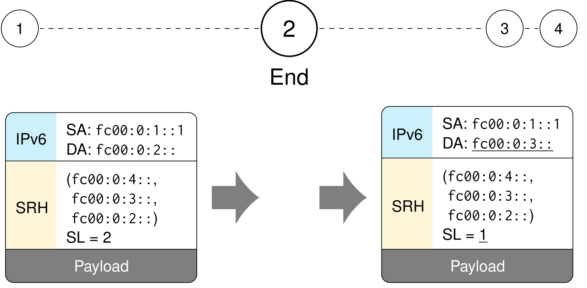
### End with PSP
#### Example 1
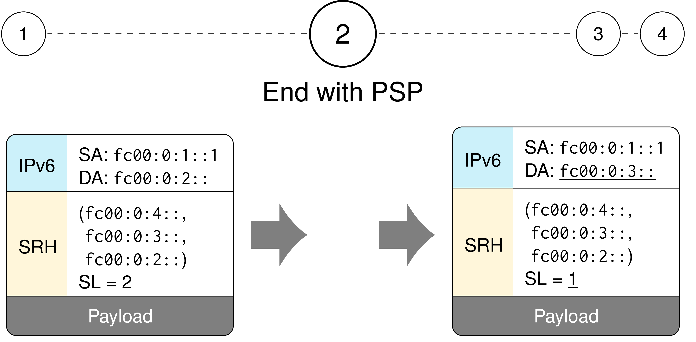
#### Example 2
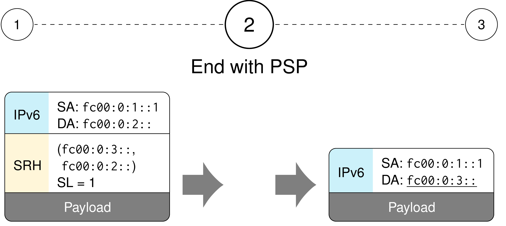
### End with USD
#### Example 1
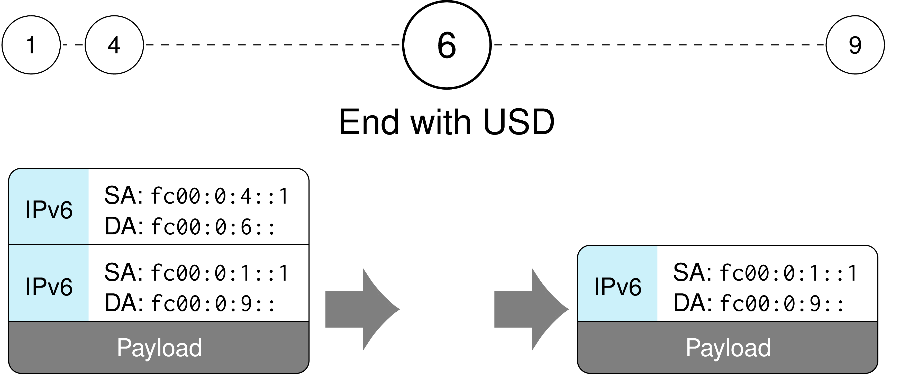
#### Example 2
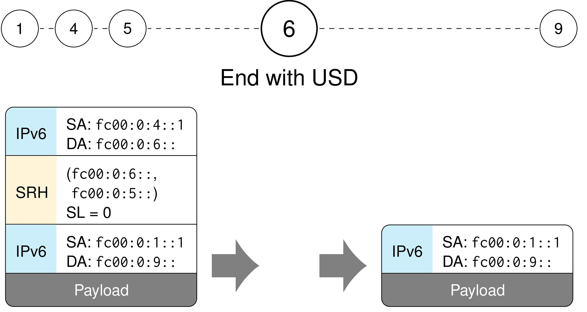
### End with uSID (uN)
#### Example 1
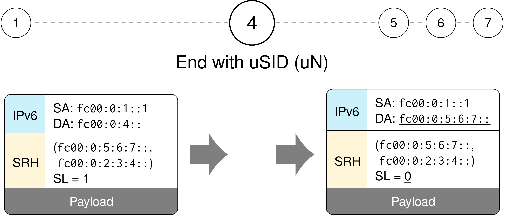
#### Example 2
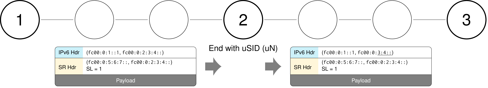
#### Example 3
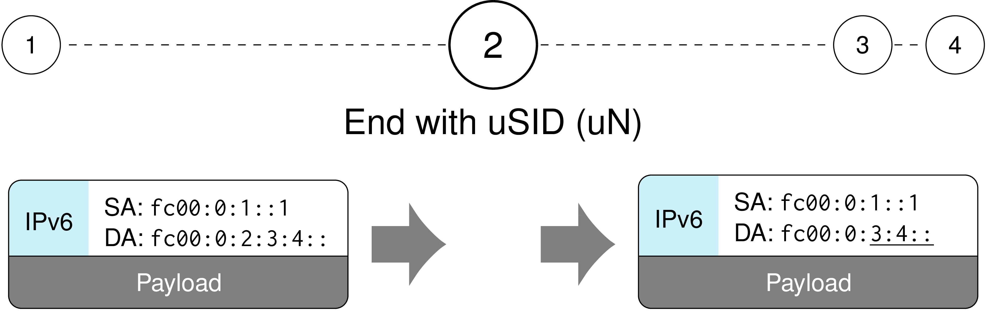

## End.X
### End.X without flavor
#### Example
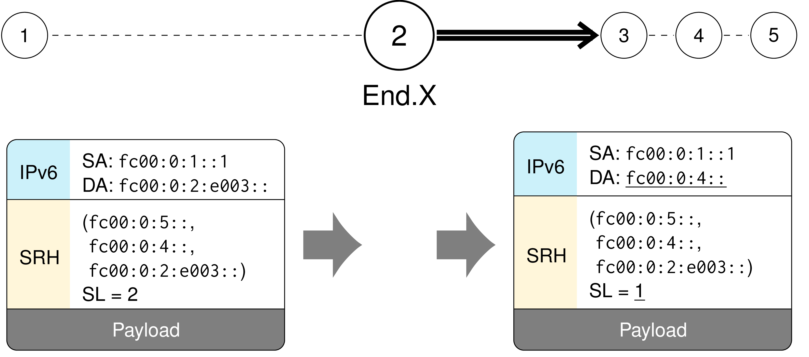
### End.X with PSP
#### Example
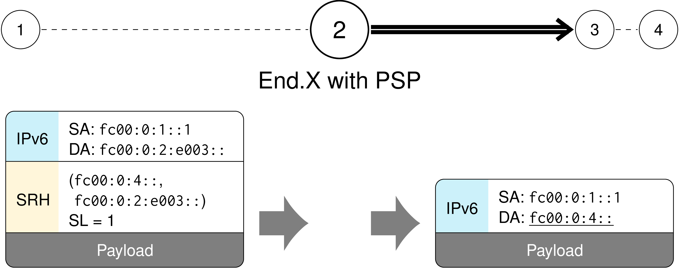
### End.X with USD
#### Example
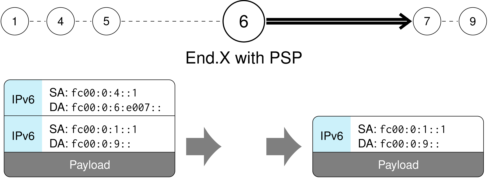
### End.X with uSID (uA)
#### Example
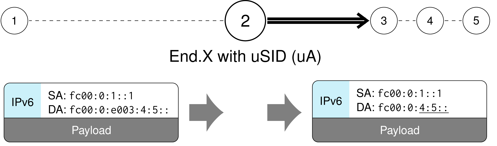
### uN + uA
#### Example
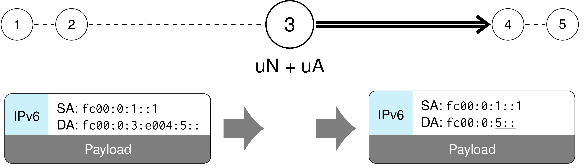

